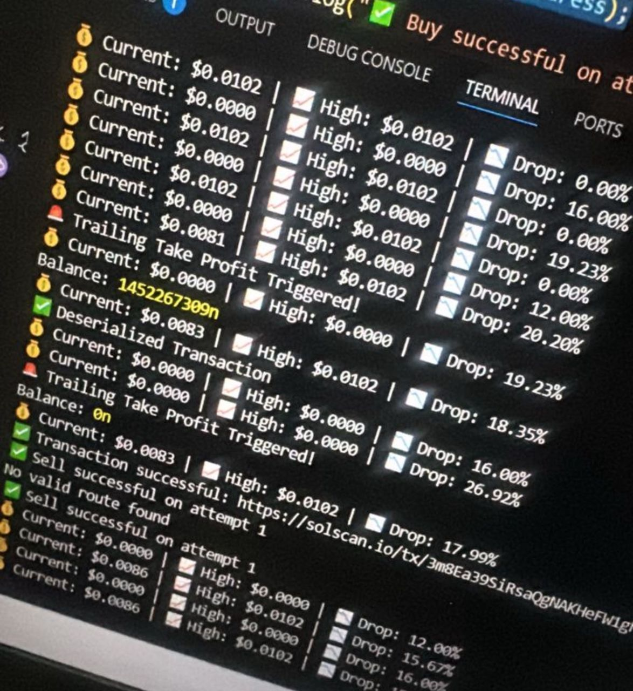
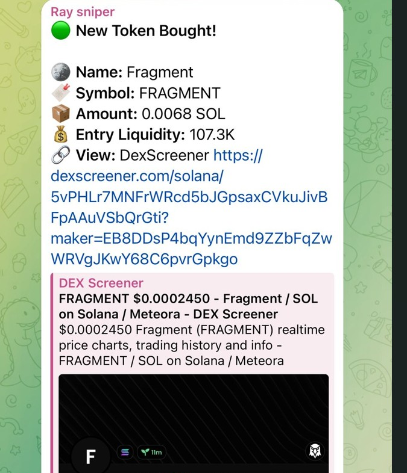
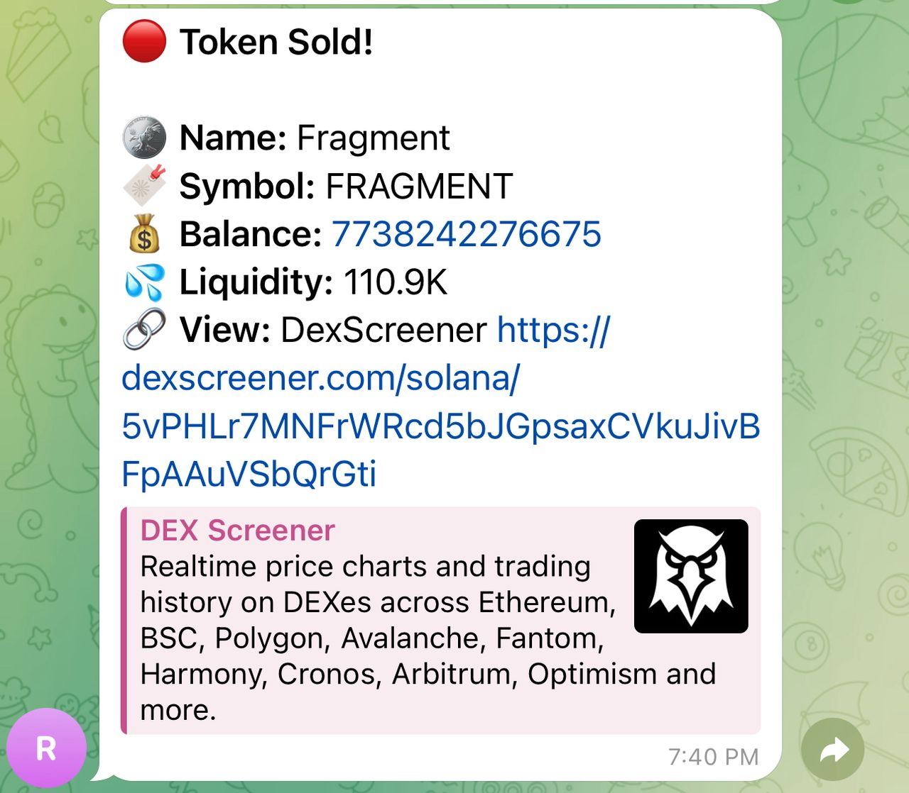
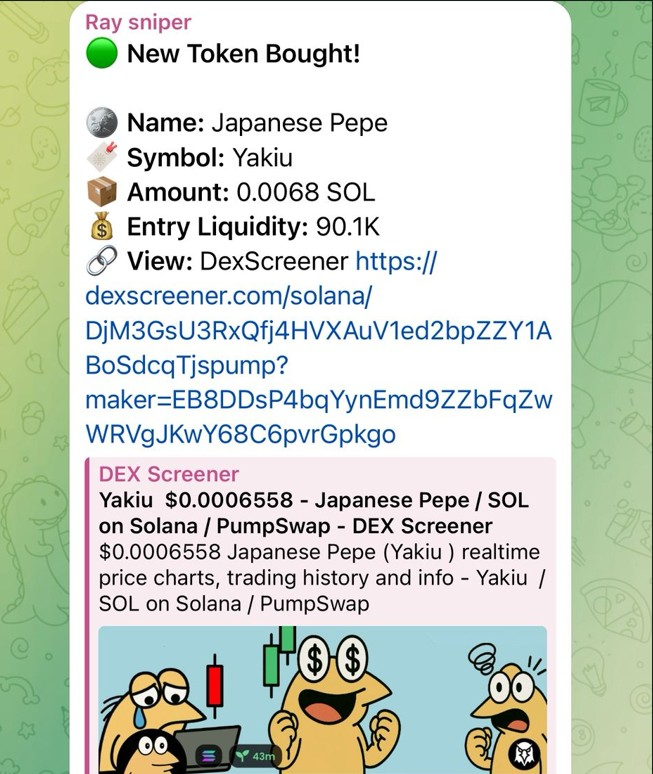
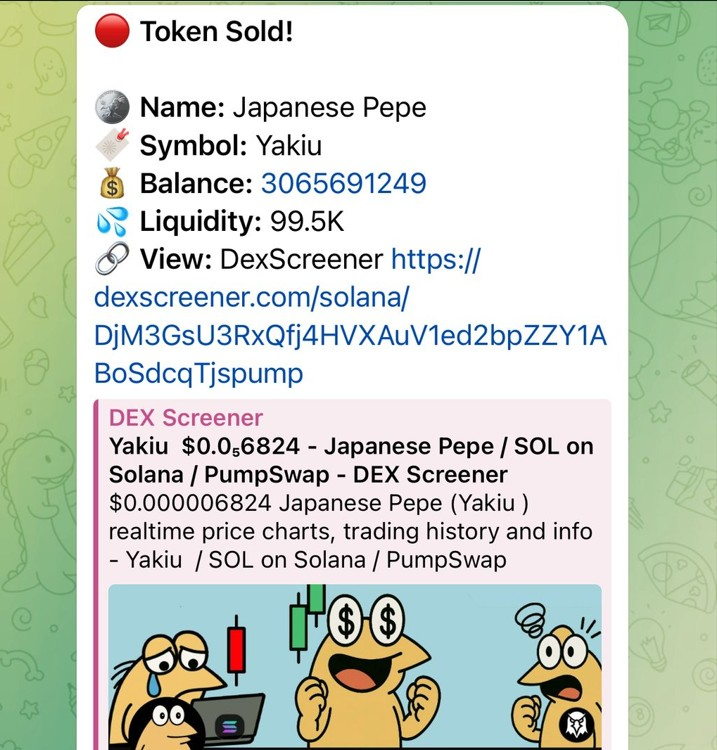

# Solana PumpFun Token Sniper Bot

A Solana sniper bot that:
- Fetches newly migrated tokens from PumpFun
- Automatically buys and sells using `createJupiterApiClient()`
- Monitors stop-loss and take-profit levels
- Sends real-time notifications via Telegram

---

## Features

- **Token Fetching** – Automatically detects new tokens on PumpFun  
- **Automated Trades** – Uses Jupiter API for fast and efficient swaps  
- **Stop-Loss Protection** – Monitors token price and executes sell orders if triggered  
- **Telegram Alerts** – Get notified for buys, sells, and errors instantly  

---

## Project Structure
.
├── bot.js # Main sniper bot logic
├── monitor.js # Stop-loss monitoring
├── telegram.js # Telegram notification system
├── .env # Environment variables
└── README.md # Project documentation


---

## Setup

1. **Clone the repository**
   ```bash
   git clone https://github.com/Harmcleff/solana-pumpfun-sniper-bot.git


2. **Install dependencies**
    ```bash
    npm install


3. **Create .env file**
Add the following variables to your .env file:
    ```bash
    TELEGRAM_BOT_TOKEN=******************
    TELEGRAM_CHAT_ID=*********
    WEBSOCKET_URL=wss://mainnet.helius-rpc.com/?api-key=******************


4. **Run the bot**
    ```bash
    node index.js

---

# How It Works

The bot connects to PumpFun to fetch new tokens.

Buys tokens instantly using Jupiter API.

monitor.js continuously checks token prices against stop-loss levels.

telegram.js sends trade notifications to your Telegram group or channel.

---

# Warning

This bot interacts with real tokens on Solana mainnet.

Use at your own risk.

Always test with small amounts first.

The authors are not responsible for any financial losses.

# Example Output



--




---





